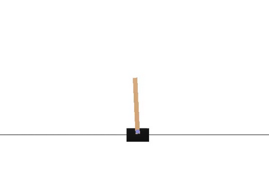

# This project is a simple solution to the cartpole balancing game using 2 methods

## 1) Random Search:
This method simply creates many random agents and chooses the best one. Because our problem is very simple, this method works well enough. If the problem is more complex, it will need more parameters that define its agents; this would, therefore, make random search not efficient as most of the random agents will not be solving our problem well enough.

## 2) Random ascent:
This method is also very simple, but it still has the dimensionality problem (complex problems are hard to solve using this method). This method works by starting with a random agent (you could even run random search on a number of agents and use the best one to start the random ascent). Then, you pick random numbers to add to your current agent's parameters. If the agent improves, keep the change; otherwise, neglect it.

### The cartpole balancing game
I used the OpenAI's gym environment to run the game. The game is very simple. The player controls a cart that he/she can move to the left or to the right. The player should try to balance a pole that is standing vertically on the cart without the pole going out of control and falling.

The game is considered solved if, according to OpenAI's documentation, "when the average reward is greater than or equal to 195.0 over 100 consecutive trials". I will try to accomplish it in the least time..
